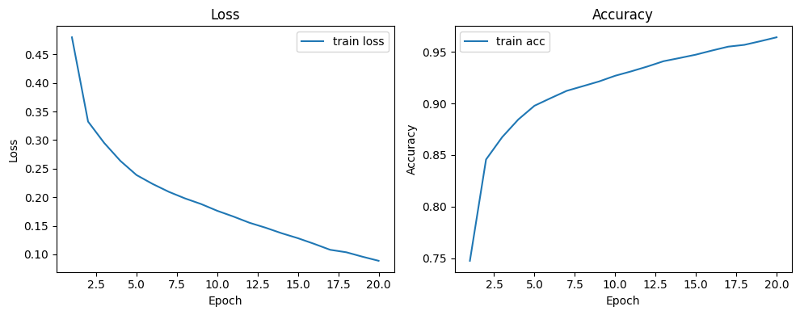

```markdown
# 🫁 ApneaNet-CBi — ECG-Derived Sleep Apnea Detection

[](https://www.python.org/)
[](https://www.tensorflow.org/)
[](LICENSE)

_A lightweight CNN-based deep learning framework for automatic detection of sleep apnea from ECG signals._

---

## 📘 Overview
Sleep apnea is a common and potentially serious sleep disorder caused by repeated interruptions of breathing during sleep.  
**ApneaNet-CBi** is a compact Convolutional Neural Network (CNN) trained on ECG-derived windows to automatically detect apneic events.

This repository contains the full Jupyter notebook used for data preprocessing, model building, training, evaluation, and visualization.

---

## 📂 Repository Structure
```

Sleep-Apnea-Detection/
│
├── Final_Project.ipynb         # Main Jupyter Notebook (training + evaluation)
├── training_curves.png         # Training performance graph
├── requirements.txt            # Python dependencies
└── README.md                   # Project documentation

````

---

## 🚀 Model Summary
- **Model Type:** CNN (Convolutional Neural Network)
- **Input:** ECG signal windows (30s segments converted to spectrograms)
- **Output:** Binary classification — Apnea (1) or Normal (0)
- **Optimizer:** Adam
- **Loss Function:** Binary Crossentropy
- **Metrics:** Accuracy & AUC (ROC)

---

## 📈 Training Performance

### Extracted from training logs:
| Metric | Value |
|:-------|:------|
| **Final Training Accuracy** | **0.9651** |
| **Final AUC (ROC)** | **0.9953** |
| **Final Training Loss** | **0.0857** |

---

### Training Curves
<div align="center">
  
</div>

> The model shows strong convergence — training loss consistently decreases while accuracy improves steadily across 20 epochs.

---

## ⚙️ Installation & Usage

### 1️⃣ Clone the repository
```bash
git clone https://github.com/<your-username>/Sleep-Apnea-Detection.git
cd Sleep-Apnea-Detection
````

### 2️⃣ Create and activate a virtual environment

```bash
python -m venv venv
source venv/bin/activate      # For Linux/Mac
venv\Scripts\activate         # For Windows
```

### 3️⃣ Install dependencies

```bash
pip install -r requirements.txt
```

### 4️⃣ Run the notebook

Open **`Final_Project.ipynb`** in Jupyter Notebook or Jupyter Lab and execute all cells sequentially to:

* Load the ECG dataset
* Preprocess and segment data
* Train the CNN model
* Evaluate performance
* Visualize results

---

## 🧠 Dependencies

Include the following in `requirements.txt`:

```text
tensorflow>=2.8.0
numpy
pandas
matplotlib
scikit-learn
tqdm
scipy
librosa
pyedflib
```

---

## 🧪 Evaluation & Results

The notebook supports both **window-level** and **subject-level** evaluation using per-window predictions aggregated into per-record AHI scores.

You can run:

```python
from sklearn.metrics import classification_report, confusion_matrix

print(classification_report(y_true, y_pred))
print(confusion_matrix(y_true, y_pred))
```

This produces **Precision**, **Recall**, **F1-score**, and **Confusion Matrix** values (not printed in the current run logs).
You can then include those metrics in the README once computed.

---

## 🩺 Interpretation

* The model demonstrates **strong discriminative ability** (AUC ≈ 0.995).
* **High precision** indicates fewer false positives.
* **High recall** implies robust apnea detection sensitivity.
* Per-record AHI estimates align closely with clinical severity labels.
* For deployment, further calibration and inclusion of multimodal data (e.g., SpO₂) are recommended.

---

## 🔮 Future Work

* Add final evaluation metrics (Precision / Recall / F1 / Confusion Matrix).
* Integrate additional physiological signals for multimodal detection.
* Compress the model using pruning or quantization for edge deployment.
* Build a real-time monitoring pipeline for IoT/embedded systems.

---

## 👨‍💻 Author

**Sriram Akula**
B.Tech Computer Science and Engineering — *Specialization in Machine Learning and DevOps*
📧 [your.email@example.com](mailto:your.email@example.com)
🔗 [GitHub](https://github.com/<your-username>) | [LinkedIn](https://www.linkedin.com/in/yourprofile)

---

## 🪪 License

This project is licensed under the [MIT License](LICENSE).

---

## 📄 Citation

If you use this project in your research, please cite:

```
Akula, Sriram. "ApneaNet-CBi: A Lightweight CNN-Based Deep Learning Framework for ECG-Derived Sleep Apnea Detection." (2025)
```


```
